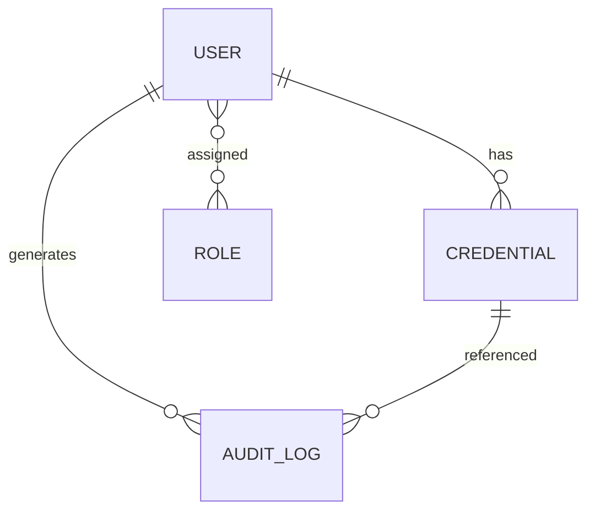
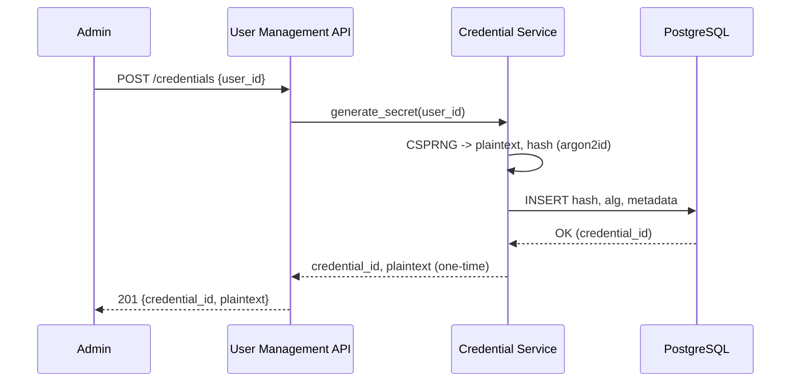

# User Management Interface for Ollama – Design Document

## 1. Executive Summary
The purpose of this system is to provide a secure, auditable, and cost‑controlled Python-based user management and credential interface for accessing the internal Ollama service, which currently runs on a private Kubernetes node. The scope covers identity and access management (user CRUD, credential generation/rotation/revocation), authentication and granular authorisation, audit logging, quotas and rate limits, and an API suitable for integration with organisational tools. The system will be deployed on Google Cloud Run with private networking to the Kubernetes cluster and will enforce strict security controls and usage limits to mitigate cost and abuse while meeting enterprise governance requirements.

## 2. Stakeholders & Context
- Lakshman (Business sponsor): Wants an organisationally shareable access URL with cost control and clear accountability.
- Alberto Hernandez (Engineer, assignee): Builds the Python interface, user management, and credentials, deploys to Cloud Run.
- DevOps (Raul): Ensures Ollama runs securely in a private Kubernetes node; expects authenticated access and policy enforcement.
- Organisation Users (Consumers): Need controlled, credential‑based API access to Ollama.
- Security & Compliance (Implied): Requires auditable access, adherence to OWASP and data protection standards.
- Platform/Cloud Team (Implied): Owns Cloud Run, networking, IAM, and observability.

## 3. Functional Requirements
1. The system SHALL provide user CRUD endpoints: create, read, update, delete.
2. The system SHALL generate individual credentials per user and store only non‑reversible hashes.
3. The system SHALL support authentication via signed API keys (HTTP header), with optional OAuth2/JWT in future.
4. The system SHALL implement role‑based authorisation for actions (e.g., admin, standard user).
5. The system SHALL rotate credentials on demand and on schedule, invalidating old keys atomically.
6. The system SHALL revoke credentials immediately and prevent further use after revocation.
7. The system SHALL issue rate‑limit decisions per user and per organisation and expose rate‑limit headers.
8. The system SHALL enforce per‑user quotas and request budgets configurable by administrators.
9. The system SHALL log all security‑relevant events (auth successes/failures, CRUD, credential lifecycle).
10. The system SHALL provide immutable audit logs with unique event IDs and timestamped entries.
11. The system SHALL expose APIs for credential lifecycle: createCredential, revokeCredential, rotateCredential.
12. The system SHALL integrate with the private Kubernetes‑hosted Ollama via private networking only.
13. The system SHALL restrict unauthenticated access and reject requests without valid credentials.
14. The system SHALL provide pagination for list endpoints and deterministic ordering.
15. The system SHALL validate inputs with strict schemas and return structured error payloads.
16. The system SHALL support idempotent user creation via external_id or email uniqueness.
17. The system SHALL provide health, readiness, and liveness endpoints for operations.
18. The system SHALL support configuration via environment variables and Secret Manager only.
19. The system SHALL provide an admin‑only endpoint to set/update per‑user quotas and roles.
20. The system SHALL produce OpenAPI documentation for all public endpoints.

## 4. Non‑Functional Requirements
- Performance: p95 latency ≤ 150 ms for auth and metadata endpoints; p95 ≤ 400 ms for credential operations under nominal load; throughput ≥ 200 RPS sustained (burstable with autoscaling).
- Security: OWASP Top‑10 safeguards; Argon2id (preferred) or bcrypt for credential hashing; TLS 1.2+ enforced end‑to‑end; HSTS enabled at edge; secrets in GCP Secret Manager; zero plaintext keys at rest.
- Availability: Target 99.9% monthly uptime; multi‑region ready via Cloud Run regional duplication and managed database HA.
- Maintainability: Clean Architecture; strict typing; 90%+ unit test statement coverage; modular components and clear interfaces.
- Testability: Unit tests with pytest; integration with TestContainers; contract tests against OpenAPI; deterministic seeds for randomness where appropriate in tests only.
- Portability: ASGI app (FastAPI) runnable locally via Docker, deployable to Cloud Run or Kubernetes.
- Observability: Structured JSON logs, distributed traces, and RED metrics; SLOs with p95/p99 alerts.
- Cost Control: Per‑user quotas, request timeouts, Cloud Run max concurrency, and budget alerts.

## 5. User Stories & Acceptance Criteria
1. As an administrator, I can create a user and issue an individual API key to enable secure, traceable access to Ollama.
   - Given a valid admin credential  
     When I POST a user with required fields  
     Then I receive 201 with user metadata and the one‑time token value and the hashed secret is persisted.
2. As an administrator, I can revoke a compromised API key so it cannot access Ollama.
   - Given a valid admin credential and an active API key  
     When I POST revokeCredential for that key  
     Then subsequent requests with that key return 401 and the audit log records the revocation event.
3. As a platform owner, I can enforce per‑user rate limits to control costs.
   - Given a configured per‑user rate limit  
     When the user exceeds the limit within a time window  
     Then responses return 429 with rate‑limit headers and corresponding counters are logged.

## 6. High‑Level Architecture

### 6.1 Context and Containers (C4)
```mermaid
graph LR
  U[Organisation User] -->|HTTPS, API key| API[User Management API (Cloud Run)]
  Admin[Admin] -->|HTTPS, Admin key| API
  API -->|Private VPC| K8s[Ollama Service (Kubernetes, private)]
  API -->|SQL| PG[(PostgreSQL)]
  API -->|Secrets| GSM[GCP Secret Manager]
  API -->|Metrics/Logs| Obs[Prometheus/Grafana/Loki/Alertmanager]
```

### 6.2 Clean Architecture Layers
```mermaid
graph TB
  subgraph Entities
    E1[User, Role, Credential, AuditLog]
  end
  subgraph UseCases
    UC1[CreateUser]
    UC2[CreateCredential]
    UC3[RevokeCredential]
    UC4[GetUser/Update/Delete]
    UC5[RateLimit & Quota]
  end
  subgraph InterfaceAdapters
    IA1[FastAPI Controllers]
    IA2[Repositories (SQLAlchemy)]
    IA3[Auth Middleware]
  end
  subgraph ExternalIO
    IO1[PostgreSQL]
    IO2[Secret Manager]
    IO3[Ollama API via K8s]
  end
  E1 --> UC1 --> IA1 --> IO1
  E1 --> UC2 --> IA2 --> IO1
  UC3 --> IA2
  IA3 --> UC5
  IA1 --> IO3
```

### 6.3 Technology Matrix
- Python: 3.12
- Web framework: FastAPI (ASGI)
- Server: Uvicorn workers via Gunicorn (UvicornWorker)
- ORM: SQLAlchemy 2.x with Alembic for migrations
- Credential store: PostgreSQL 14+ (primary); LDAP optional future
- Secret manager: GCP Secret Manager
- Container runtime: Docker; deploy to Cloud Run; private VPC connector to GKE
- CI/CD: GitHub Actions or Cloud Build; Trivy scan; Cosign signing; SLSA provenance

## 7. Component Design
- API Layer (FastAPI): Exposes endpoints; validates requests; returns structured responses; dependency‑injects use cases.
  - Public Interface: REST endpoints defined in Section 10.
  - Dependencies: Auth middleware, use cases, repositories.
  - Failure Modes: 4xx validation errors, 401/403 for auth, 5xx for dependency failure; circuit breaking to Ollama.
- Auth Middleware: Extracts API key, verifies hash, enforces roles and quotas, attaches principal to context.
  - Public Interface: Dependency callable in FastAPI.
  - Failure Modes: Expired/Revoked keys; replay attempts; clock skew handled via monotonic counters.
- Credential Service: Generates, hashes, stores, rotates, and revokes secrets.
  - Public Interface:
    - generate_secret(): returns one‑time plaintext and hash
    - store_hash(user_id, hash, metadata): persists hash and metadata
    - rotate(user_id): atomically revokes old, issues new; returns new one‑time plaintext
    - revoke(credential_id): marks revoked with timestamp and reason
  - Dependencies: CSPRNG, Argon2id/bcrypt, SQLAlchemy repositories, clock.
  - Failure Modes: Entropy source failure, DB contention; must be idempotent and transactional with retry.
- Repositories (SQLAlchemy): CRUD for users, roles, credentials, audits.
  - Failure Modes: Constraint violations; connectivity; stale connections.
- Rate Limiter/Quota: Token bucket per user; persisted counters; returns headers.
  - Failure Modes: Store unavailability; fallback to conservative deny with 503 after backoff.
- Audit Logger: Writes immutable events with correlation IDs.
  - Failure Modes: Write failure triggers fallback queue with retry and alerts.

## 8. Data Model

### 8.1 ER Diagram


### 8.2 SQLAlchemy Declarative Models (DDL)
```python
from datetime import datetime
from sqlalchemy import (
    Column, String, Integer, Boolean, DateTime, ForeignKey, UniqueConstraint,
    Index, Text
)
from sqlalchemy.orm import declarative_base, relationship

Base = declarative_base()

class User(Base):
    __tablename__ = "users"
    id = Column(Integer, primary_key=True)
    external_id = Column(String(100), nullable=True)
    email = Column(String(320), nullable=False, unique=True)
    display_name = Column(String(200), nullable=True)
    is_active = Column(Boolean, nullable=False, default=True)
    created_at = Column(DateTime, nullable=False, default=datetime.utcnow)
    updated_at = Column(DateTime, nullable=False, default=datetime.utcnow)
    credentials = relationship("Credential", back_populates="user", cascade="all, delete-orphan")
    roles = relationship("Role", secondary="user_roles", back_populates="users")
    __table_args__ = (
        UniqueConstraint("external_id", name="uq_users_external_id"),
        Index("ix_users_email", "email"),
    )

class Role(Base):
    __tablename__ = "roles"
    id = Column(Integer, primary_key=True)
    name = Column(String(50), nullable=False, unique=True)
    users = relationship("User", secondary="user_roles", back_populates="roles")

class UserRole(Base):
    __tablename__ = "user_roles"
    user_id = Column(Integer, ForeignKey("users.id", ondelete="CASCADE"), primary_key=True)
    role_id = Column(Integer, ForeignKey("roles.id", ondelete="CASCADE"), primary_key=True)
    assigned_at = Column(DateTime, nullable=False, default=datetime.utcnow)

class Credential(Base):
    __tablename__ = "credentials"
    id = Column(Integer, primary_key=True)
    user_id = Column(Integer, ForeignKey("users.id", ondelete="CASCADE"), nullable=False, index=True)
    hash = Column(String(255), nullable=False)
    salt = Column(String(128), nullable=True)
    alg = Column(String(32), nullable=False)  # argon2id|bcrypt
    created_at = Column(DateTime, nullable=False, default=datetime.utcnow)
    expires_at = Column(DateTime, nullable=True)
    revoked = Column(Boolean, nullable=False, default=False)
    revoked_at = Column(DateTime, nullable=True)
    label = Column(String(100), nullable=True)
    user = relationship("User", back_populates="credentials")
    __table_args__ = (
        Index("ix_credentials_user_revoked", "user_id", "revoked"),
    )

class AuditLog(Base):
    __tablename__ = "audit_logs"
    id = Column(Integer, primary_key=True)
    user_id = Column(Integer, ForeignKey("users.id", ondelete="SET NULL"), nullable=True)
    credential_id = Column(Integer, ForeignKey("credentials.id", ondelete="SET NULL"), nullable=True)
    event_type = Column(String(50), nullable=False)
    occurred_at = Column(DateTime, nullable=False, default=datetime.utcnow)
    ip = Column(String(45), nullable=True)
    user_agent = Column(String(256), nullable=True)
    detail = Column(Text, nullable=True)
    __table_args__ = (
        Index("ix_audit_logs_event_time", "event_type", "occurred_at"),
    )
```

### 8.3 Row‑Level Security (PostgreSQL)
```sql
ALTER TABLE users ENABLE ROW LEVEL SECURITY;
ALTER TABLE credentials ENABLE ROW LEVEL SECURITY;
ALTER TABLE audit_logs ENABLE ROW LEVEL SECURITY;

CREATE POLICY users_isolation ON users
  USING (id::text = current_setting('app.user_id', true));

CREATE POLICY credentials_isolation ON credentials
  USING (user_id::text = current_setting('app.user_id', true));

CREATE POLICY audit_logs_read ON audit_logs
  FOR SELECT
  USING (user_id::text = current_setting('app.user_id', true) OR EXISTS (SELECT 1 FROM roles r JOIN user_roles ur ON ur.role_id=r.id WHERE ur.user_id::text=current_setting('app.user_id', true) AND r.name='admin'));
```

## 9. Security & Compliance
- Threat Model (STRIDE):
  - Spoofing: API keys are random 256‑bit secrets; headers only over TLS; key hashes stored.
  - Tampering: Signed responses where needed; DB roles with least privilege; Alembic migrations controlled.
  - Repudiation: Immutable audit logs with event IDs and timestamps; correlation IDs in logs.
  - Information Disclosure: No plaintext secrets stored; encrypted transport; principle of least privilege.
  - Denial of Service: Token buckets, global rate limits, autoscaling, request timeouts.
  - Elevation of Privilege: RBAC; admin‑only endpoints; defence‑in‑depth validation and schema checks.
- Password/API Key Policy: Min 32 bytes entropy; argon2id with memory‑hard parameters; rotation ≤ 90 days recommended.
- MFA Readiness: Admin access supports MFA through upstream IdP (future).
- GDPR/Data Minimisation: Store required fields only; configurable retention; right‑to‑erasure honoured via delete and purge job.
- Key Management Lifecycle: Generate → Hash → Store hash → Use → Rotate/Revoke → Expire; secrets for infra held in Secret Manager with versioning and automatic rotation reminders.

## 10. API Specification (OpenAPI 3.1)
```yaml
openapi: 3.1.0
info:
  title: User Management API
  version: 1.0.0
servers:
  - url: https://api.example.org
paths:
  /users:
    post:
      summary: Create user
      operationId: createUser
      security: [{ ApiKeyAuth: [] }]
      requestBody:
        required: true
        content:
          application/json:
            schema:
              type: object
              required: [email]
              properties:
                email: { type: string, format: email }
                display_name: { type: string }
                roles: { type: array, items: { type: string } }
      responses:
        '201':
          description: Created
          headers:
            X-RateLimit-Limit: { schema: { type: integer } }
            X-RateLimit-Remaining: { schema: { type: integer } }
            X-RateLimit-Reset: { schema: { type: integer } }
          content:
            application/json:
              schema:
                $ref: '#/components/schemas/User'
        '400': { $ref: '#/components/responses/BadRequest' }
        '401': { $ref: '#/components/responses/Unauthorised' }
  /users/{userId}:
    get:
      summary: Get user
      operationId: getUser
      security: [{ ApiKeyAuth: [] }]
      parameters:
        - in: path
          name: userId
          required: true
          schema: { type: integer }
      responses:
        '200':
          description: OK
          content:
            application/json:
              schema: { $ref: '#/components/schemas/User' }
        '404': { $ref: '#/components/responses/NotFound' }
        '401': { $ref: '#/components/responses/Unauthorised' }
    patch:
      summary: Update user
      operationId: updateUser
      security: [{ ApiKeyAuth: [] }]
      requestBody:
        required: true
        content:
          application/json:
            schema:
              type: object
              properties:
                display_name: { type: string }
                is_active: { type: boolean }
                roles: { type: array, items: { type: string } }
      responses:
        '200': { description: Updated, content: { application/json: { schema: { $ref: '#/components/schemas/User' } } } }
        '400': { $ref: '#/components/responses/BadRequest' }
        '404': { $ref: '#/components/responses/NotFound' }
        '401': { $ref: '#/components/responses/Unauthorised' }
    delete:
      summary: Delete user
      operationId: deleteUser
      security: [{ ApiKeyAuth: [] }]
      responses:
        '204': { description: No Content }
        '404': { $ref: '#/components/responses/NotFound' }
        '401': { $ref: '#/components/responses/Unauthorised' }
  /credentials:
    post:
      summary: Create credential
      operationId: createCredential
      security: [{ ApiKeyAuth: [] }]
      requestBody:
        required: true
        content:
          application/json:
            schema:
              type: object
              required: [user_id]
              properties:
                user_id: { type: integer }
                label: { type: string }
      responses:
        '201':
          description: Created
          content:
            application/json:
              schema: { $ref: '#/components/schemas/CredentialSecret' }
        '400': { $ref: '#/components/responses/BadRequest' }
        '401': { $ref: '#/components/responses/Unauthorised' }
  /credentials/{credentialId}/revoke:
    post:
      summary: Revoke credential
      operationId: revokeCredential
      security: [{ ApiKeyAuth: [] }]
      parameters:
        - in: path
          name: credentialId
          required: true
          schema: { type: integer }
      responses:
        '204': { description: No Content }
        '404': { $ref: '#/components/responses/NotFound' }
        '401': { $ref: '#/components/responses/Unauthorised' }
components:
  securitySchemes:
    ApiKeyAuth:
      type: apiKey
      in: header
      name: X-API-Key
  responses:
    BadRequest:
      description: Bad Request
      content:
        application/json:
          schema: { $ref: '#/components/schemas/Error' }
    NotFound:
      description: Not Found
      content:
        application/json:
          schema: { $ref: '#/components/schemas/Error' }
    Unauthorised:
      description: Unauthorised
      content:
        application/json:
          schema: { $ref: '#/components/schemas/Error' }
  schemas:
    Error:
      type: object
      required: [code, message]
      properties:
        code: { type: string }
        message: { type: string }
        trace_id: { type: string }
    User:
      type: object
      properties:
        id: { type: integer }
        email: { type: string, format: email }
        display_name: { type: string }
        is_active: { type: boolean }
        roles: { type: array, items: { type: string } }
        created_at: { type: string, format: date-time }
    CredentialSecret:
      type: object
      description: One-time secret returned on creation only
      properties:
        credential_id: { type: integer }
        plaintext: { type: string }
        expires_at: { type: string, format: date-time }
```

## 11. Business Logic Flows

### 11.1 Create Individual Credential


### 11.2 Audit Credential Lifecycle
```mermaid
sequenceDiagram
  participant Actor
  participant API
  participant DB
  Actor->>API: create/revoke/rotate credential
  API->>DB: INSERT audit_logs (event_type, occurred_at, user_id, credential_id)
  DB-->>API: OK
  API-->>Actor: 2xx
  API->>Obs: Emit metrics and logs with correlation_id
```

## 12. Testing Strategy
- Unit: pytest with 90%+ overall statement coverage; 100% for auth and credentials modules; hypothesis strategies for edge cases.
- Integration: TestContainers for PostgreSQL; ephemeral DB per run; migrations applied before tests.
- Contract: Prism or Schemathesis to validate OpenAPI conformance.
- Security: Bandit and Safety in CI; Trivy for image scan; dependency pinning with pip‑tools.
- Performance: Locust load profiles for p95/p99 SLOs; regression gates.
- Linting: ruff/flake8, black, isort; mypy for typing.
- CI Gates: Fail builds if coverage or security checks fail; block merge on failed gates.

## 13. Deployment & Operations
- Dockerfile (multi‑stage, non‑root, distroless):
```dockerfile
FROM python:3.12-slim AS build
WORKDIR /app
COPY pyproject.toml requirements.txt ./
RUN pip install --upgrade pip && pip wheel --wheel-dir=/wheels -r requirements.txt
COPY . .
FROM gcr.io/distroless/python3-debian12:nonroot
WORKDIR /app
ENV PYTHONUNBUFFERED=1
COPY --from=build /wheels /wheels
COPY . .
ENV PYTHONPATH=/app
EXPOSE 8080
CMD ["-m", "gunicorn", "-k", "uvicorn.workers.UvicornWorker", "--bind", "0.0.0.0:8080", "app.main:app"]
```
- Cloud Run: Min instances = 0, Max concurrency = 40, CPU throttling on idle, request timeout = 30 s, VPC connector to GKE.
- Image Signing: Cosign sign‑attest in CI; store signatures in OCI registry.
- Helm Chart Outline (for alternative K8s deployment):
```yaml
apiVersion: v2
name: user-management-api
type: application
version: 0.1.0
appVersion: "1.0.0"
```
- Probes: `/healthz` liveness, `/readyz` readiness; initialDelaySeconds 5, periodSeconds 10.
- HPA: Target CPU 70%; custom metric requests_per_second via Prometheus adapter; minReplicas 1, maxReplicas 10.
- Secrets: Inject via GCP Secret Manager + CSI driver when on GKE; env vars only on Cloud Run referencing Secret Manager versions.
- Backups: Daily logical backups for PostgreSQL; restore runbook with PITR; encrypted at rest.
- Observability: Prometheus scraping; Grafana dashboards; Loki for logs; Alertmanager SLO burn alerts (p95 > target for 5m and 1h).

## 14. Development Workflow
- Trunk‑based development with short‑lived feature branches.
- Conventional Commits for semantic versioning.
- pre‑commit hooks: black, ruff, isort, mypy, bandit, secrets scan.
- Automatic semantic versioning and release notes via semantic‑release.

## 15. Risks & Mitigations
1. Networking to private Ollama fails (VPC misconfig). Mitigation: VPC connector tests in CI; runbooks; fallback to K8s ingress with mTLS.
2. Credential leakage via logs. Mitigation: Never log secrets; structured filtering; secret scanning in CI.
3. Cost overruns due to misuse. Mitigation: Strict quotas, 429 on excess, Cloud budget alerts, per‑user limits.
4. DB performance bottlenecks. Mitigation: Indexes, connection pooling, read replicas if needed.
5. Compliance drift. Mitigation: Automated security scans; policy as code; periodic audits.

## 16. Milestones & Deliverables
- Week 1: Architecture scaffolding, data model, OpenAPI draft; CI skeleton; baseline tests. DoD: Docs merged; CI green.
- Week 2: Implement user CRUD, credential service, auth middleware; unit tests; integration tests with TestContainers. DoD: 90% coverage; endpoints pass contract tests.
- Week 3: Rate limiting, quotas, audit logging; performance tests; observability. DoD: p95 latency meets targets; dashboards live.
- Week 4: Deployment to Cloud Run with VPC; SLO alerts; runbooks; security review. DoD: Signed image deployed; access controlled; demo to stakeholders.

## 17. Appendices
- Glossary:  
  - API Key: Random secret identifying a principal; sent via X‑API‑Key header.  
  - RBAC: Role‑based access control.  
  - RLS: Row‑level security in PostgreSQL.  
- References: NIST SP 800‑63; OWASP ASVS; OWASP Top 10; Python PEP 8/484; Argon2 RFCs; Google Cloud Run best practices.
- Decision Log Template:
  - Context  
  - Decision  
  - Alternatives considered  
  - Consequences  
  - Date and approver

